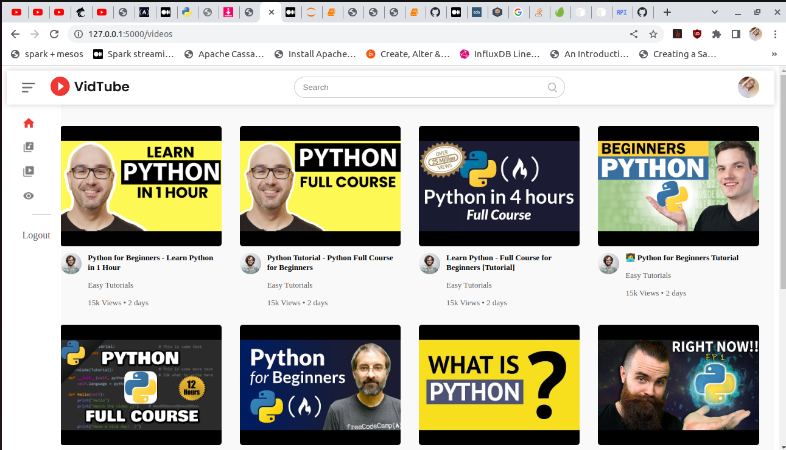
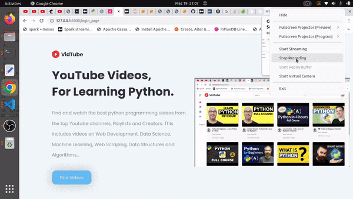

# pythontube

> A web application for finding and watching python programming videos from YouTube.

<p align="center">
  
  
  
  
  
  
  
  
  
  
  
  
  
  
  
</p>

## Application Overview

This is a web application that enables the user to find and watch the best python programming videos on YouTube. The application allows the user to find videoson machine learning, Data Structures and Algorithms, general programming, web development as well as web scraping.



## Application Demo

The application supports the following operations:

1. Account registration using your Google account..
2. Searching for videos based on topic, creator or channel.
3. A custom reccomendation system for reccomending videos, playlists and channels.
4. The application uses a custom built wrapper library for the YouTube API called ```youtube```. You can learn more about it from it's github account.

<p align=center>
  
</p>

## Local Setup

To work with the application locally, first make sure the following are present:

1. A Google Account (with an active email account)
2. A Google API Key. Follow the instructions here to create one. One for use with Google Auth and another for accessing the YouTube API.
3. Docker and docker-compose are locally installed.

Folow these steps to start the application:

1. Clone the project repo:

  ```sh
  git clone https://github.com/twyle/python-youtube-learning-site.git
  ```

2. Navigate to the project directory, then create the project secrets:

  ```sh
  cd photo-sharing-app
  touch ./services/app/.env
  ```

  And then paste the following:
  ```sh
    FLASK_APP=manage.py
    FLASK_DEBUG=True
    FLASK_ENV=development
    GOOGLE_OAUTH_CLIENT_ID=
    GOOGLE_OAUTH_CLIENT_SECRET=
    OAUTHLIB_INSECURE_TRANSPORT=1
    OAUTHLIB_RELAX_TOKEN_SCOPE=1
    SECRET_KEY=
    POSTGRES_HOST=localhost
    POSTGRES_DB=python-learning-app
    POSTGRES_PORT=5432
    POSTGRES_USER=lyle
    POSTGRES_PASSWORD=lyle
    CREDENTIALS_FILE=
  ```

3. Start the logging service:
  ```sh
  docker-compose up -f services/logging/docker-compose.yml --build -d
  ```

  This takes a while

4. Start the application:
  ```sh
  docker-compose -f docker-compose-dev up --build -d
  ```

5. Navigate to ```flask.localhost``` to see the application.

## Deployment

The application is containerized and deployed to AWS EC2. 


## Author :black_nib:

* **Lyle Okoth** <[twyle](https://github.com/twyle)>
